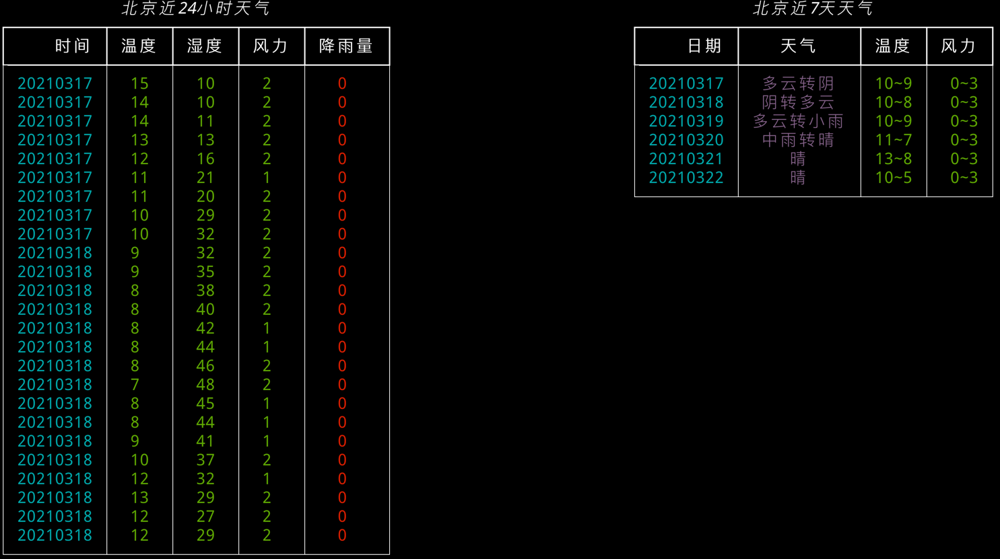

# 天气预报

## 功能：作为控制台天气查询工具
从[中国天气]('http://www.weather.com.cn/')获取数据，在控制台以表格的形式展示出来。
用法:
```
python main.py query 北京
```


## 功能：作为爬虫爬取天气数据
用法:
```
python main.py scrape 北京
```

# 使用技术
* [click](https://click.readthedocs.io/)
* [rich](https://rich.readthedocs.io/)
* [BeautifulSoup](https://www.crummy.com/software/BeautifulSoup/bs4/doc/)
* [requests](https://requests.readthedocs.io/)
